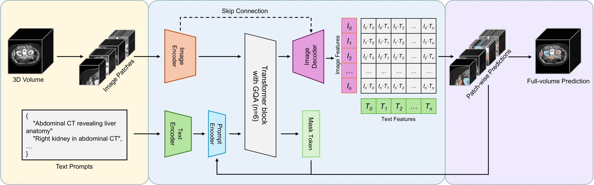

# Med3DVLM: An Efficient Vision-Language Model for 3D Medical Image Analysis

<font size=3><div align='center' > <a href=/>**Paper**</a> | [**Datasets**](#datasets) | [**Model**](#model) | [**Training**](#training) | [**Evaluation**](#evaluation)</div></font>

Official PyTorch implementation of: 

[ESICA: A Scalable Framework for Text-Guided 3D Medical Image Segmentation]()



Text-guided 3D medical image segmentation offers a flexible alternative to class-based and spatial prompt-based models by allowing users to specify regions of interest directly in natural language. This paradigm avoids reliance on predefined label sets, reduces ambiguous outputs, and aligns more naturally with clinical workflows. However, existing text-guided frameworks are often computationally expensive, exhibit weak text–volume feature alignment, and fail to capture fine anatomical details. We propose ESICA, a lightweight and scalable framework that addresses these challenges through three innovations: (1) a similarity-matrix-based mask prediction formulation that enhances semantic alignment, (2) an efficient decomposed decoder with adapter modules for accurate volumetric decoding, and (3) a two-pass refinement strategy that sharpens boundaries and resolves uncertain regions. To improve training stability and generalization, ESICA adopts a two-stage scheme consisting of positive-only pretraining followed by balanced fine-tuning. On the CVPR-BiomedSegFM benchmark spanning five imaging modalities (CT, MRI, PET, ultrasound, and microscopy), ESICA achieves state-of-the-art segmentation accuracy, while the compact ESICA4-Lite variant attains similar segmentation performance with substantially fewer parameters, yielding a superior efficiency–accuracy trade-off. Our framework advances text-guided segmentation toward efficient, scalable, and clinically deployable systems. 

## Requirements
* Python==3.12.11
* torch==2.8.0
* torchvision==0.23.0
* monai==1.5.0
* deepspeed==0.17.4

## Installation
First, clone the repository to your local machine:
```bash
git clone https://github.com/mirthAI/ESICA.git
cd ESICA
```
To install the required packages, you can use the following command:
```bash
conda create -n ESICA python=3.12.11
conda activate ESICA
pip install -r requirements.txt
```

## Datasets
In the paper, we train and evaluate our model on [CVPR-BiomedSegFM](https://huggingface.co/datasets/junma/CVPR-BiomedSegFM) datasets.

### Prepare data
Use the following command to prepare the data:

```bash
sh scripts/prepare_data.sh
```

## Model
The pre-trained model weights are available on Hugging Face: [ESICA Pre-trained Weights](https://huggingface.co/MagicXin/ESICA).

## Training
To train the model, use the following command:

```bash
sh scripts/train.sh
```

or you can train the lightweight version of the model using the following command:

```bash
sh scripts/train_lite.sh
```


## Evaluation
To evaluate the model, use the following command:

```bash
sh scripts/eval.sh
```


## Citations and Acknowledgements
The code is only for research purposes. If you have any questions regarding how to use this code, feel free to contact Yu Xin at yu.xin@ufl.edu.

Kindly cite the following papers if you use our code.

```bibtex

```